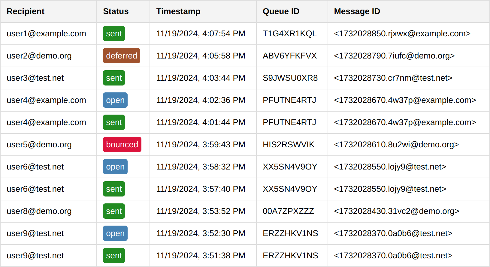

# Mailcow Status Tracker

This is a Node.js-based application for tracking and processing email logs from a Mailcow server. It fetches logs, stores them in a SQLite database, and provides a web interface and API endpoints for viewing email statuses.\
It also supports sending emails and tracking opens via a tracking pixel. And it supports triggering external webhooks to notify other servers with the status updates.



## Features

- **Track Mail Status**: Fetch and store email logs from a Mailcow server.
- **Webhooks**: Trigger external webhooks for email status updates.
- **Email Sending**: Send emails with optional open tracking.
- **Log Retention**: Automatically truncate old logs after a configurable period.
- **Dashboard**: View the latest email logs via a web interface.

## Installation

1. **Clone the Repository**:
   ```bash
   git clone https://github.com/hacktisch/mailcow-status-tracker.git
   cd mailcow-status-tracker
   ```

2. **Install Dependencies**:
   ```bash
   npm install
   ```

3. **Configure Environment Variables**:
   - Create a `.env` file in the root directory.
   - Copy the contents of `.env.example`:
     ```bash
     cp .env.example .env
     ```
   - Update the variables in `.env` to match your setup.

## Environment Variables

| Variable             | Description                                                      | Example Value                                    |
|-----------------------|------------------------------------------------------------------|-------------------------------------------------|
| `API_KEY`            | API key for accessing Mailcow logs.                              | `000000-000000-000000-000000-000000`            |
| `API_URL_BASE`       | Base URL for the API of your Mailcow instance.                   | `https://mail.example.com/api/v1/get/logs/postfix` |
| `WEBHOOK`            | Webhook URL for sending status updates.                         | `https://www.example.com/mail-webhook`          |
| `LOGS_PER_BATCH`     | Number of logs to fetch per batch.                              | `100`                                           |
| `CRON_SCHEDULE`      | Cron schedule for periodic synchronization.                     | `* * * * *`                                     |
| `PORT`               | Port for the Express server.                                    | `3005`                                          |
| `LOG_RETENTION_DAYS` | Number of days after which to truncate log entries.             | `7`                                             |
| `APP_URL_ORIGIN`     | Base URL for generating tracking pixels in sent emails.         | `https://mailcow-api.example.com`               |
| `SMTP_HOST`          | SMTP server host for sending emails.                           | `mail.example.com`                              |
| `SMTP_PORT`          | SMTP server port for sending emails.                           | `465`                                           |
| `SMTP_SECURE`        | Whether the SMTP server uses TLS/SSL (`true` or `false`).       | `true`                                          |
| `SMTP_ACCOUNTS`      | JSON object of email accounts with passwords for sending mail.  | `{"alice@example.com":"PASSWORD1","bob@example.com":"PASSWORD2"}` |
| `SMTP_FALLBACK_ACCOUNT`      | The account that is used if an unknown account was passed to the send route | `alice@example.com` |
| `AUTH_PASSWORD`      | Password to protect the `/send` route. Optional.                | `PasswordToProtectTheMailRoute123`              |

## Usage

1. **Start the Server**:
   ```bash
   npm start
   ```
   or for development:
   ```bash
   npm run dev
   ```

2. **Access the Dashboard**:
   Open your browser and navigate to:
   ```
   http://localhost:3005
   ```
   The dashboard displays the latest 100 log entries and automatically triggers the sync function before loading the data.

3. **API Endpoints**:

   - **Send Email**:
     ```http
     POST /send
     ```
     **Body Parameters** (JSON and multipart/form-data are both supported):
     - `password` (string, optional): Password to authorize the request if `AUTH_PASSWORD` is set.
     - `from` (string): Sender's email in the format `"Name <email@example.com>"` or just `email@example.com`.
     - `to` (string): Recipient's email address.
     - `subject` (string): Subject of the email.
     - `text` (string, optional): Plain text content of the email.
     - `html` (string, optional): HTML content of the email.
     - `includeTracker` (boolean, optional): Whether to include a tracking pixel to track opens.
     - `cc` (array, optional): Array of CC addresses.
     - `bcc` (array, optional): Array of BCC addresses.
     - `attachments` (array, optional): Array of files in format `[{content:'...',filename:'...'}]`

     **Example Request**:
     ```json
     {
       "password": "PasswordToProtectTheMailRoute123",
       "from": "Alice <alice@example.com>",
       "to": "recipient@example.com",
       "subject": "Hello World",
       "html": "<p>This is a test email.</p>",
       "includeTracker": true,
       "attachments": [files]
     }
     ```

   - **Fetch Logs by Message ID**:
     ```http
     GET /message?message_id=<MESSAGE_ID>
     ```

   - **Manually Trigger Sync**:
     ```http
     GET /sync-logs
     ```

## Customize Cron Schedule

- Update `CRON_SCHEDULE` in `.env` to adjust synchronization frequency.
- Example (run every 10 minutes):
  ```plaintext
  CRON_SCHEDULE="*/10 * * * *"
  ```
- Ensure that `LOGS_PER_BATCH` exceeds the number of log entries generated within each cron interval to avoid missing logs.

## Deployment

Use a process manager like [PM2](https://pm2.keymetrics.io/) or Docker to run the app persistently.

## License

MIT